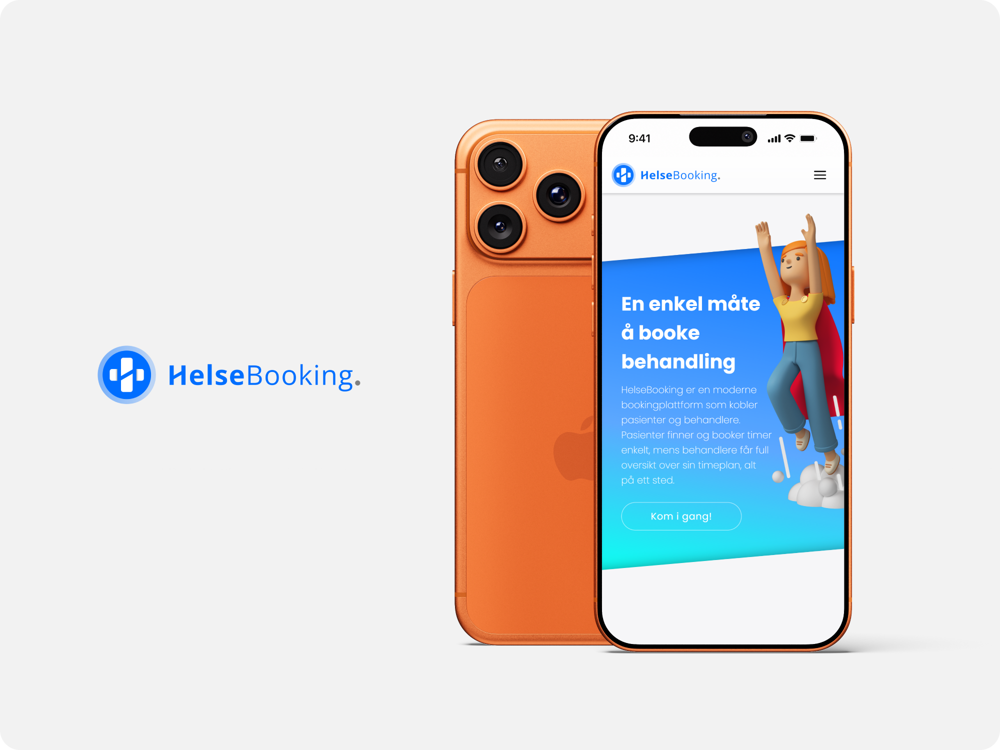

# Hei, jeg er Patrik 👋

Fullstack-utvikler med bakgrunn fra helseteknologi. Opptatt av brukeropplevelse like mye som koden bak.

Se mitt siste prosjekt **[HelseBooking](https://github.com/patriklie/HelseBooking)**

HelseBooking er en fullstack bookingapplikasjon for helsetjenester hvor pasienter kan finne og booke time hos behandlere. Repoet har god dokumentasjon og en live demo, ta gjerne en titt 🤓

## 📫 Kontakt
> patrik.lie@hotmail.com

## 💻 Teknologier

<!-- ### Frontend
React · JavaScript · Redux · HTML · CSS

### Backend
Node.js · Express · MongoDB · Mongoose

#### Tools
Git · npm -->

  
  
  
  
  
  

<!--  -->
